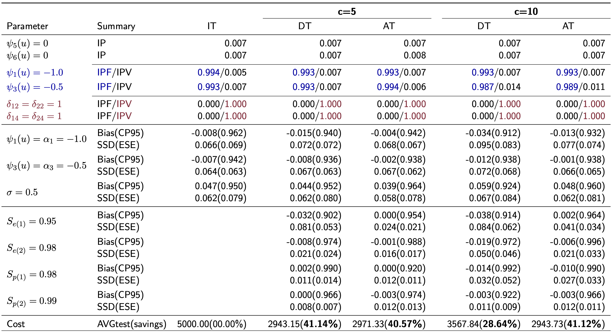

## RVCM4GT

[]()
[]()
[]()

This repository contains R codes (for reproducibility) along with simulation results for "**Regularized Bayesian varying coefficient regression for group testing data**". Our model is try to estimate an individual-level regression model based on
group testing data that can capture the age-varying impact on
the Chlamydia risk with selection. To relate available information, we consider

$$
\text{logit}(\text{Pr}(\widetilde Y_i=1\mid \boldsymbol x_i, u_i))=\underbrace{\psi_0(u_i)+\sum_{d=1}^p x_{id}\psi_d(u_i)}\_{\text{Age-varying Effects}} + \underbrace{\sum_{\ell=1}^L r_\ell(i)\gamma_\ell}\_{\text{Random Effect}} \quad\text{for }i=1,\ldots,N,
$$

where $\widetilde Y_i$ is the hidden chlamydia status for $i^{th}$ patient, age $u_i$, $\boldsymbol x_i=(x_{i1},\ldots,x_{ip})^\top$ are covariates, and $\psi_d(u_i)=\delta_{1d}(\alpha_d+\delta_{2d}\beta_d(u_i))$ for binary indicators $\delta_{1d},\delta_{2d}$; see more details in the paper. In short, our stochastic search variable selection categorize each of covariates into one of three groups:

- $\delta_{1d}=0\longrightarrow$ insignificant effects.
- $\delta_{1d}=1$
	* $\delta_{2d}=0\longrightarrow$ age-independent effects.
	* $\delta_{2d}=1\longrightarrow$ age-varying effects.

To reproduce the results in the paper, we provide implementation details as follows. 

```sh
username@login001 ~$ git clone git@github.com:yizenglistat/rvcm4gt.git
username@login001 ~$ cd rvcm4gt
```
In addition, for the privacy of the Iowa SHL group testing data, we create a simulated fake Iowa group testing data (under `/data/simulated_fake_data.csv`) for illustration. As we will see the code running on the fake data set successfully below


### Arguments

```r
# A demo example to run 500 repetitions in one machine.
task_id <- 1	
nreps <- 500
Ns <- c(3000, 5000)
pool_sizes <- c(5, 10)
model_names <- c("m1", "m2")
testings <- c("AT", "DT", "IT")
N_test <- 600
sigma <- 0.5
```

- `task_id`
> The machine id. For example, 1,...,100 if running on the cluster. In this way, we will run 5 simulations independently on 100 nodes to have a total of 500 repetitions. 

- `nreps`
> The repetitions.

- `Ns`
> A vector of sample sizes.

- `pool_sizes`
> A vector of pool sizes.

- `model_names`
> A vector of model names. Different model names corresponds to different varying function sets.

- `testings`
> A vector of testing protocols such as AT (array testing), DT (Dorfman Testing) or IT (Individual Testing).

- `N_test`
> Number of knots values in inference for estimated varying functions. 

- `sigma`
> True random effect standard deviation

### Simulation Reproduction

After setting up the environment (`requirement.txt`) and arguments, one should be able to run the following code in `R` to reproduce simulation results in the paper.

```r
# R version 4.4.0 or above

> source('run.r')
```

After collecting `.RData` files under `output/`, one should be able to reproduce the results subsequently. The following demo figure and demo table show that $\textcolor{red}{\textbf{red}}$ means the $\textcolor{red}{\textbf{age-varying effects}}$, $\textcolor{blue}{\textbf{blue}}$ means the significant but $\textcolor{blue}{\textbf{age-independent effects}}$ and $\textbf{black}$ means the $\textbf{insignificant effects}$ can be both correctly identified and estimated; see details in the paper.





> IP: the inclusion probability of the any significant effect, i.e., $\alpha_d$ or $\beta_d(u)$. 

> IPF: the inclusion probability of the age-independent effect, i.e., $\alpha_d$ only.

> IPV: the inclusion probability of the age-varying effect, i.e., $\beta_d(u)$ only.

### Application Reproduction
We include a simulated (fake) group testing data that closely emulate the structure of Iowa group testing data under the folder `data/fake/`. To reproduce the simulated data analysis results in the Supplementary Masterials, one can run the following script.

```r
# R version 4.4.0 or above

> source('run_fake.r')
```

### Authors

<a href="https://github.com/yizenglistat">
  
</a>
<a href="https://github.com/Harrindy">
  
</a>
<a href="https://scholar.google.com/citations?user=vSy9J1HEZlYC&hl=en">
  
</a>

- [Yizeng Li](https://github.com/yizenglistat)
- [Dewei Wang](https://github.com/Harrindy) - *the corresponding author*
- [Joshua M. Tebbs](https://scholar.google.com/citations?user=vSy9J1HEZlYC&hl=en)

### License
This project is licensed under the MIT License - see the [License](LICENSE.txt) file for details.
