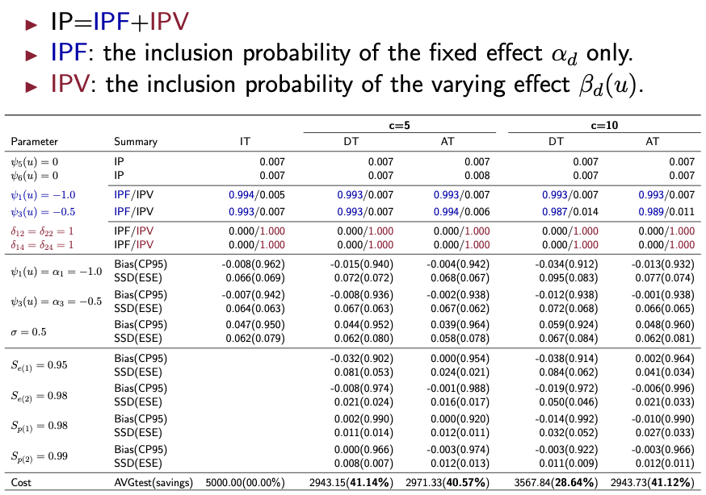

## GVCM4GT

This repository contains R codes along with simulation results for "**Regularized Bayesian varying coefficient mixed models for group testing data**". Our model is try to estimate an individual-level regression model based on
group testing data that can capture the age-varying impact on
the Chlamydia risk with selection. To relate available information, we consider

$$
\text{logit}(\text{Pr}(\widetilde Y_i=1\mid \boldsymbol x_i, u_i))=\underbrace{\sum_{d=0}^p x_{id}\psi_d(u_i)}\_{\text{Age-varying Effects}} + \underbrace{\sum_{\ell=1}^L r_\ell(i)\gamma_\ell}\_{\text{Random Effect}} \quad\text{for }i=1,\ldots,N,
$$

where $\boldsymbol x_i=(x_{i0},x_{i1},\ldots,x_{ip})^\top$ and $\psi_d(u_i)=\delta_{1d}(\alpha_d+\delta_{2d}\beta_d(u_i))$ for binary indicators $\delta_{1d},\delta_{2d}$; see more details in the paper. In short, our stochastic search variable selection categorize each of covariates into three groups:

- $\delta_{1d}=0\longrightarrow$ insignificant effects.
- $\delta_{1d}=1$
	* $\delta_{2d}=0\longrightarrow$ age-independent effects.
	* $\delta_{2d}=1\longrightarrow$ age-varying effects.

To reproduce the results in the paper, we provide implementation details as follows. 

```sh
username@login001 ~$ git clone git@github.com:yizenglistat/GVCM4GT.git
username@login001 ~$ cd GVCM4GT
```

### Arguments

```r
# A demo example to run 500 repetitions in one machine.
task_id 		<- 1 						
nreps 			<- 500
Ns 				<- c(3000, 5000)
pool_sizes 		<- c(5, 10)
model_names 	<- c("m1", "m2")
testings 		<- c("AT", "DT", "IT")
N_test 			<- 600
sigma 			<- 0.5
```

- `task_id`
> The machine id. For example, 1,...,100 if running on the cluster. In this way, we will run 5 simulations independently on 100 nodes to have a total of 500 repetitions. 

- `nreps`
> The repetitions.

- `Ns`
> A vector of sample sizes.

- `pool_sizes`
> A vector of pool sizes.

- `model_names`
> A vector of model names. Different model names corresponds to different varying function sets.

- `testings`
> A vector of testing protocols such as AT (array testing), DT (Dorfman Testing) or IT (Individual Testing).

- `N_test`
> Number of knots values in inference for estimated varying functions. 

- `sigma`
> True random effect standard deviation

### Reproduce

After setting up the environment (`requirement.txt`) and arguments, one should be able to run the following code in `R` to reproduce simulation results in the paper.

```r
source('main.r')
```

After collecting `.RData` files under `output/`, one should be able to reproduce the results subsequently. The following demo figure and demo table show that $\textcolor{red}{\textbf{red}}$ means the $\textcolor{red}{\textbf{age-varying effects}}$, $\textcolor{blue}{\textbf{blue}}$ means the significant but $\textcolor{blue}{\textbf{age-independent effects}}$ and $\textbf{black}$ means the $\textbf{insignificant effects}$ can be both correctly identified and estimated; see details in the paper.




### Authors

* [Yizeng Li](https://yizengli.com)
* [Dewei Wang\*](https://sites.google.com/view/deweiwang)
* [Joshua M. Tebbs](https://people.stat.sc.edu/tebbs/)

> \*: the corresponding author.